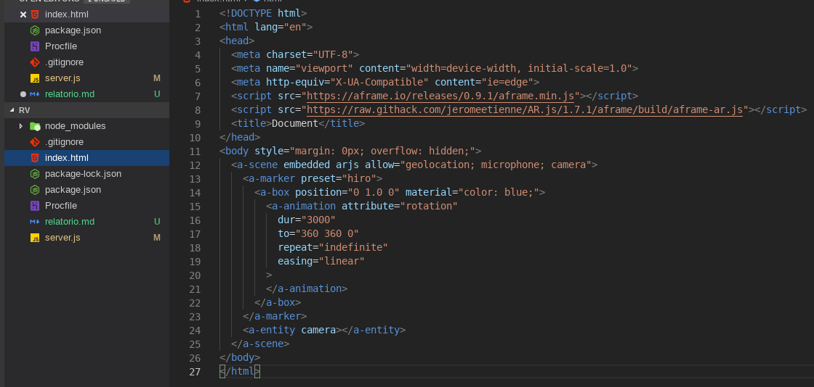
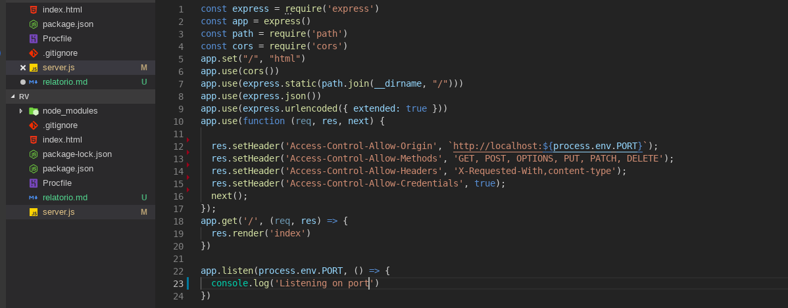

**Rodrigo Rolim Veras**
**1694111**
**Kamilla dallman**

#### Realidade Aumentada Mobile

Essa aplicação de realidade aumentada foi feita em javascript na plataforma node. 
A aplicação executa no navegador de qualquer celular com camera frontal. Para fazer tal
aplicação foi utilizado uma biblioteca em javascript chamada de AR.js.

A aplicação é servida através do servidor node.js e foi implantada no host da heroku.
##### Código da view da aplicação
É nessa parte do código que está configurado o uso da biblioteca AR.js, e também estão configurados o o marcador, o uso da camera para detectar o marcador e o objeto virtual gerado.

##### Código do servidor

Esse é código onde está configurado o servidor node, por meio do qual a aplicação será disponibilizada em uma determinada porta.

##### Link de acesso à aplicação

link para a [RV](https://infinite-sea-95325.herokuapp.com/ "clique aqui para ver, professor") disponiblizada no heroku. Acesse-o de seu celular e aponte a camera para o marcador abaixo.

Obs: Como esta sendo usado a versão gratuita para teste deste servidor, após um tempo de inatividade, o heroku derruba a aplicação.
##### marcador usado

**Repositório do código:** [repositório]()
